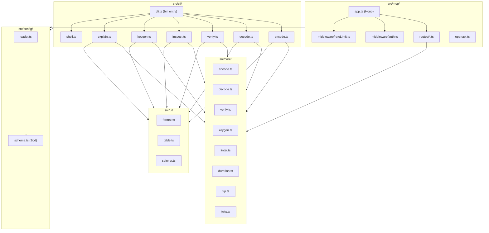

# Design Document: jwt-cli

## Overview

`jwt-cli` is a dual-purpose npm package: a developer CLI (`jwt`) for the full JWT lifecycle and a Model Context Protocol (MCP) HTTP/JSON server exposing the same capabilities to AI agents. Both surfaces share a pure, I/O-free `Core` library, ensuring that all JWT logic is tested once and reused everywhere.

The design is organized around a strict layering rule: `src/core/` contains only pure functions; all I/O (filesystem, network, stdin/stdout, clipboard) lives in `src/cli/`, `src/mcp/`, or `src/config/`. This makes the core trivially testable and the I/O layers thin adapters.

### Key Design Goals

- Security-opinionated: embed modern JWT best practices via a configurable Linter, not just wrap a library
- Deterministic: `--fake-time` injects a fixed clock into Core so tests never depend on wall time
- Composable: every CLI command delegates to a Core function; the MCP server calls the same Core functions
- Dual output: pretty terminal UX by default, `--json` for machine consumption

---

## Architecture



### Layering Rules

| Layer | Allowed dependencies | Forbidden |
|---|---|---|
| `core/` | `jose`, `zod`, `uuid` | Any I/O, `fs`, `fetch`, `process.env` |
| `cli/` | `core/`, `config/`, `ui/`, `commander`, `picocolors`, `boxen`, `ora`, `table` | Direct JWT logic |
| `mcp/` | `core/`, `config/`, `hono`, `zod` | Direct JWT logic |
| `config/` | `zod`, `smol-toml` (or `@iarna/toml`) | JWT logic |
| `ui/` | `picocolors`, `boxen`, `table`, `cli-table3` | JWT logic, I/O |

---

## Components and Interfaces

### Core Module (`src/core/`)

All Core functions are pure: they accept plain data and return plain data or a typed `Result<T, E>` discriminated union. No exceptions are thrown across module boundaries.

```typescript
// Shared result type used throughout Core
type Ok<T> = { ok: true; value: T };
type Err<E> = { ok: false; error: E };
type Result<T, E> = Ok<T> | Err<E>;
```

#### `core/encode.ts`

```typescript
interface EncodeOptions {
  payload: Record<string, unknown>;
  header?: Record<string, unknown>;
  secret?: string;           // HMAC
  privateKeyPem?: string;    // Asymmetric PEM
  privateKeyJwk?: JWKObject; // Asymmetric JWK
  alg: SupportedAlgorithm;
  kid?: string;
  now?: Date;                // injected clock (Fake_Time)
}

function encodeToken(opts: EncodeOptions): Promise<Result<string, EncodeError>>;
```

#### `core/decode.ts`

```typescript
interface DecodedToken {
  header: Record<string, unknown>;
  payload: Record<string, unknown>;
  signaturePresent: boolean;
}

function decodeToken(token: string): Result<DecodedToken, DecodeError>;
```

#### `core/verify.ts`

```typescript
interface VerifyOptions {
  token: string;
  secret?: string;
  publicKeyPem?: string;
  publicKeyJwk?: JWKObject;
  jwksUri?: string;
  alg?: SupportedAlgorithm;
  requiredClaims?: string[];
  leewaySeconds?: number;
  now?: Date;
}

type VerifyFailureReason =
  | "signature_mismatch"
  | "expired"
  | "not_yet_valid"
  | "algorithm_mismatch"
  | "missing_claim"
  | "malformed";

interface VerifyError {
  reason: VerifyFailureReason;
  message: string;
}

function verifyToken(opts: VerifyOptions): Promise<Result<DecodedToken, VerifyError>>;
```

#### `core/keygen.ts`

```typescript
type KeyType = "rsa" | "ec" | "ed25519";
type KeyFormat = "jwk" | "pem";

interface KeygenOptions {
  type: KeyType;
  format: KeyFormat;
  kid?: string;
  rsaBits?: number;   // default 2048
  ecCurve?: string;   // default "P-256"
}

interface GeneratedKeyPair {
  privateKey: string;  // JWK JSON string or PEM
  publicKey: string;
  kid?: string;
}

function generateKeyPair(opts: KeygenOptions): Promise<Result<GeneratedKeyPair, KeygenError>>;
```

#### `core/linter.ts`

```typescript
type Severity = "info" | "warn" | "error";

interface LintRule {
  id: string;
  severity: Severity;
  check: (token: DecodedToken, config: LintConfig) => LintFinding | null;
}

interface LintFinding {
  ruleId: string;
  severity: Severity;
  description: string;
  suggestedFix: string;
}

interface LintConfig {
  disabledRules?: string[];
  severityOverrides?: Record<string, Severity>;
  piiClaimPatterns?: string[];
}

function lintToken(token: DecodedToken, config: LintConfig): LintFinding[];
```

#### `core/duration.ts`

```typescript
// Parses strings like "1h", "30m", "7d", "2w" into seconds
function parseDuration(input: string): Result<number, DurationError>;
```

#### `core/nlp.ts`

```typescript
// Converts natural language descriptions to JWT payload objects
// e.g. "admin user expires in 1 hour" → { role: "admin", exp: ... }
function parseNaturalLanguagePayload(
  description: string,
  now: Date
): Result<Record<string, unknown>, NlpError>;
```

#### `core/jwks.ts`

```typescript
// In-memory JWKS cache (process-lifetime)
interface JwksCache {
  get(uri: string): Promise<Result<JWKSDocument, JwksError>>;
  invalidate(uri: string): void;
}

function createJwksCache(): JwksCache;
```

### CLI Module (`src/cli/`)

Commander wiring. Each command file exports a `Command` instance that is registered on the root program in `cli.ts`.

```typescript
// cli.ts
import { Command } from "commander";
const program = new Command("jwt");
program.version(VERSION);
program.option("--fake-time <iso8601>", "override system clock");
program.option("--config <path>", "path to config file");
// ... register subcommands
```

Each command handler:
1. Reads config via `src/config/loader.ts`
2. Merges CLI flags (flags win over config)
3. Calls Core function
4. Formats output via `src/ui/`
5. Exits with appropriate Exit_Code

### MCP Module (`src/mcp/`)

Hono application with middleware stack and route handlers.

```typescript
// app.ts
import { Hono } from "hono";
const app = new Hono();
app.use("*", corsMiddleware);
app.use("*", rateLimitMiddleware);
app.use("/encode", "/decode", ..., authMiddleware);
app.route("/", encodeRoute);
// ...
app.get("/docs", openApiHandler);
```

Each route handler:
1. Validates request body with Zod schema
2. Calls Core function
3. Applies claim redaction if configured
4. Returns JSON response

### Config Module (`src/config/`)

```typescript
// schema.ts - Zod schema for .jwt-cli.toml
const ConfigSchema = z.object({
  defaults: z.object({
    iss: z.string().optional(),
    aud: z.string().optional(),
    alg: SupportedAlgorithmSchema.optional(),
    jwks: z.string().url().optional(),
  }).optional(),
  keys: z.object({
    type: z.enum(["rsa", "ec", "ed25519"]).optional(),
    privateKeyPath: z.string().optional(),
    publicKeyPath: z.string().optional(),
  }).optional(),
  profiles: z.record(z.object({
    ttl: z.string().optional(),
    scopes: z.array(z.string()).optional(),
    aud: z.string().optional(),
  })).optional(),
  lint: z.object({
    disabledRules: z.array(z.string()).optional(),
    severityOverrides: z.record(z.enum(["info", "warn", "error"])).optional(),
    piiClaimPatterns: z.array(z.string()).optional(),
  }).optional(),
});

type Config = z.infer<typeof ConfigSchema>;
```

```typescript
// loader.ts
function findConfigFile(startDir: string): string | null;
function loadConfig(filePath: string): Result<Config, ConfigError>;
function mergeConfig(fileConfig: Config, cliFlags: Partial<Config>): Config;
```

### UI Module (`src/ui/`)

Pure formatting functions that accept data and return strings. No direct console.log calls — callers decide how to output.

```typescript
// format.ts
function formatDecodedToken(decoded: DecodedToken, opts: FormatOptions): string;
function formatLintFindings(findings: LintFinding[]): string;
function formatVerifyResult(result: VerifyResult): string;
function formatKeyPair(pair: GeneratedKeyPair, format: KeyFormat): string;

// table.ts
function buildFindingsTable(findings: LintFinding[]): string;
function buildInspectTable(inspection: InspectResult): string;

// spinner.ts
function withSpinner<T>(label: string, fn: () => Promise<T>): Promise<T>;
```

---

## Data Models

### Supported Algorithms

```typescript
const SUPPORTED_ALGORITHMS = [
  "HS256", "HS384", "HS512",
  "RS256", "RS384", "RS512",
  "ES256", "ES384", "ES512",
  "EdDSA",
  "PS256", "PS384", "PS512",
] as const;

type SupportedAlgorithm = typeof SUPPORTED_ALGORITHMS[number];
```

### Token Inspection Result

```typescript
interface InspectResult {
  status: "valid" | "expired" | "not_yet_valid" | "unverified";
  algorithm: string;
  kid?: string;
  issuer?: string;
  subject?: string;
  audience?: string | string[];
  issuedAt?: Date;
  expiresAt?: Date;
  notBefore?: Date;
  customClaims: Record<string, unknown>;
  timeUntilExpiry?: number;   // seconds, negative if expired
  verificationResult?: Result<true, VerifyError>;
  lintFindings: LintFinding[];
}
```

### Config File Shape

```toml
# .jwt-cli.toml example
[defaults]
iss = "https://auth.example.com"
aud = "my-api"
alg = "ES256"

[keys]
privateKeyPath = "./keys/private.pem"
publicKeyPath  = "./keys/public.pem"

[profiles.dev]
ttl    = "1h"
scopes = ["read", "write"]
aud    = "dev-api"

[lint]
disabledRules     = ["hmac-preferred-asymmetric"]
piiClaimPatterns  = ["email", "phone", "ssn"]

[lint.severityOverrides]
"missing-exp" = "error"
```

### Exit Codes

```typescript
const EXIT_CODES = {
  SUCCESS: 0,
  USER_ERROR: 1,    // bad input, missing key, validation failure
  INTERNAL_ERROR: 2, // unexpected exception, bug
} as const;
```

### MCP Request/Response Schemas

```typescript
// POST /encode
const EncodeRequestSchema = z.object({
  payload: z.record(z.unknown()),
  alg: SupportedAlgorithmSchema,
  secret: z.string().optional(),
  privateKeyJwk: z.record(z.unknown()).optional(),
  exp: z.string().optional(),   // duration string
  iss: z.string().optional(),
  sub: z.string().optional(),
  aud: z.string().optional(),
  kid: z.string().optional(),
  fakeTime: z.string().datetime().optional(),
});

// POST /verify
const VerifyRequestSchema = z.object({
  token: z.string(),
  secret: z.string().optional(),
  publicKeyJwk: z.record(z.unknown()).optional(),
  jwksUri: z.string().url().optional(),
  alg: SupportedAlgorithmSchema.optional(),
  requiredClaims: z.array(z.string()).optional(),
  leewaySeconds: z.number().int().nonnegative().optional(),
  fakeTime: z.string().datetime().optional(),
});
```

---

## Key Algorithms

### Duration Parsing (`core/duration.ts`)

Parses strings of the form `<number><unit>` where unit is one of: `s` (seconds), `m` (minutes), `h` (hours), `d` (days), `w` (weeks). Compound durations like `"1h30m"` are also supported.

```
parseDuration("1h")   → Ok(3600)
parseDuration("30m")  → Ok(1800)
parseDuration("7d")   → Ok(604800)
parseDuration("1h30m")→ Ok(5400)
parseDuration("abc")  → Err({ message: "Invalid duration: abc" })
```

Algorithm:
1. Match all `(\d+)([smhdw])` groups via regex
2. If no groups matched and input is non-empty → return Err
3. Sum each group's value × multiplier
4. Return Ok(totalSeconds)

### Natural Language Payload Parsing (`core/nlp.ts`)

Lightweight rule-based parser (no LLM dependency). Recognizes patterns:
- `"expires in <duration>"` → sets `exp`
- `"issued by <string>"` → sets `iss`
- `"for <string>"` → sets `sub`
- `"role: <string>"` or `"<string> user"` → sets `role`
- `"scope: <csv>"` → sets `scope` array

Falls back to returning an empty payload with a warning finding if no patterns match.

### JWKS Caching (`core/jwks.ts`)

Simple Map-based in-memory cache keyed by URI. Cache entries never expire within a process (process-lifetime cache). On cache miss, fetches via `fetch()` (Node 18 built-in), validates the response shape with Zod, and stores the result. On fetch error, returns `Err` without caching.

```
get(uri):
  if cache.has(uri) → return Ok(cache.get(uri))
  response = await fetch(uri)
  if !response.ok → return Err(...)
  body = await response.json()
  validated = JWKSSchema.safeParse(body)
  if !validated.success → return Err(...)
  cache.set(uri, validated.data)
  return Ok(validated.data)
```

### Config Discovery (`config/loader.ts`)

Walk upward from `startDir` checking for `.jwt-cli.toml` at each level:

```
findConfigFile(startDir):
  dir = startDir
  loop:
    candidate = path.join(dir, ".jwt-cli.toml")
    if fs.existsSync(candidate) → return candidate
    parent = path.dirname(dir)
    if parent === dir → return null  // reached filesystem root
    dir = parent
```

### Config Merging

Priority (highest to lowest): CLI flags → environment variables → Config_File → built-in defaults.

`mergeConfig` performs a shallow merge at the top level and a deep merge within `defaults` and `lint` sections. CLI flags are represented as a `Partial<Config>` and always win.

---

## CLI Command Structure

```
jwt [global options] <command> [command options] [args]

Global options:
  --help
  --version
  --fake-time <iso8601>
  --config <path>
  --json

Commands:
  encode <payload|description>
    --secret <string>
    --key <path>
    --alg <algorithm>
    --header <json>
    --kid <string>
    --exp <duration>
    --iat
    --nbf <duration>
    --iss <string>
    --sub <string>
    --aud <string>
    --jti
    --copy
    --profile <name>

  decode <token|->
    --json
    --batch

  verify <token|->
    --secret <string>
    --key <path>
    --jwks <url>
    --alg <algorithm>
    --require <claim>  (repeatable)
    --leeway <seconds>
    --json
    --batch

  inspect <token|->
    --secret <string>
    --key <path>
    --jwks <url>
    --json
    --batch

  keygen <rsa|ec|ed25519>
    --jwk
    --pem
    --kid <string>
    --out-dir <path>
    --bits <number>    (RSA only)
    --curve <string>   (EC only)

  explain <token|->
    --json

  shell
    (no additional flags)

  mcp serve
    --port <number>    (default 3000)
    --host <string>    (default 0.0.0.0)
```

Commander wiring pattern:

```typescript
// src/cli/commands/encode.ts
import { Command } from "commander";
import { encodeToken } from "../../core/encode.js";
import { loadConfig } from "../../config/loader.js";

export function buildEncodeCommand(): Command {
  return new Command("encode")
    .argument("<payload>", "JSON payload or natural language description")
    .option("--secret <string>")
    .option("--key <path>")
    .option("--alg <algorithm>")
    .option("--exp <duration>")
    // ...
    .action(async (payload, opts, cmd) => {
      const globalOpts = cmd.parent?.opts();
      const config = await loadConfig(globalOpts?.config);
      const merged = mergeOptions(config, opts);
      const result = await encodeToken(merged);
      if (!result.ok) { handleError(result.error); process.exit(1); }
      output(result.value, globalOpts?.json);
    });
}
```

---

## MCP Server Design

### Hono Application Structure

```
src/mcp/
  app.ts          – Hono app factory, middleware registration
  routes/
    encode.ts
    decode.ts
    verify.ts
    inspect.ts
    keygen.ts
    explain.ts
  middleware/
    auth.ts       – Bearer token check against MCP_API_KEY
    rateLimit.ts  – sliding window counter (in-memory Map)
    redact.ts     – claim redaction middleware
  openapi.ts      – OpenAPI 3.1 spec generation
  schemas.ts      – Zod request/response schemas
```

### Middleware Stack (in order)

1. CORS (`hono/cors`) — configurable origins from config
2. Rate limiter — sliding window, configurable req/min, returns 429
3. Auth — checks `Authorization: Bearer` against `MCP_API_KEY` env var (skipped if env var unset), returns 401
4. Route handlers
5. Error handler — catches unhandled errors, returns 500 with sanitized message

### Rate Limiting Design

Simple in-memory sliding window per IP:

```typescript
interface RateLimitEntry {
  timestamps: number[];  // epoch ms of recent requests
}
const store = new Map<string, RateLimitEntry>();

// On each request:
// 1. Get client IP from request
// 2. Filter timestamps to those within the window (e.g., last 60s)
// 3. If count >= limit → return 429
// 4. Else push current timestamp, continue
```

### Token Redaction in Logs

All logging middleware truncates token strings:

```typescript
function redactToken(token: string): string {
  return token.length > 20 ? `${token.slice(0, 20)}...` : token;
}
```

### OpenAPI Spec

Generated programmatically in `openapi.ts` using the Zod schemas as the source of truth. Served at `GET /docs` as a JSON document. Each endpoint documents:
- Request body schema (from Zod)
- Success response schema
- Error response schemas (400, 401, 422, 429, 500)

---

## Security Linter Rule System

### Rule Registry

Rules are defined as objects implementing `LintRule` and registered in an array:

```typescript
// core/linter.ts
const BUILT_IN_RULES: LintRule[] = [
  missingExpRule,
  longLivedTokenRule,
  missingNbfRule,
  noneAlgorithmRule,
  hmacPreferredAsymmetricRule,
  piiClaimsRule,
];
```

### Built-in Rules

| Rule ID | Severity | Condition |
|---|---|---|
| `missing-exp` | `warn` | `payload.exp` is absent |
| `long-lived-token` | `warn` | `exp - iat > 86400` (24 hours) |
| `missing-nbf-long-lived` | `info` | `exp - iat > 3600` and `nbf` absent |
| `none-algorithm` | `error` | `header.alg === "none"` |
| `hmac-preferred-asymmetric` | `info` | `alg` is HS256/HS384/HS512 |
| `pii-claims` | `warn` | any claim key matches a PII pattern |

### Rule Execution

```typescript
function lintToken(token: DecodedToken, config: LintConfig): LintFinding[] {
  return BUILT_IN_RULES
    .filter(rule => !config.disabledRules?.includes(rule.id))
    .flatMap(rule => {
      const finding = rule.check(token, config);
      if (!finding) return [];
      const overriddenSeverity = config.severityOverrides?.[rule.id];
      return [{ ...finding, severity: overriddenSeverity ?? finding.severity }];
    })
    .sort((a, b) => SEVERITY_ORDER[b.severity] - SEVERITY_ORDER[a.severity]);
}
```

### Severity Ordering

`error` (2) > `warn` (1) > `info` (0) — findings are sorted descending.

---

## Error Handling

### Result Type Pattern

All Core functions return `Result<T, E>` rather than throwing. CLI and MCP layers unwrap results and translate errors to user-facing messages or HTTP responses.

### CLI Error Handling

```typescript
function handleCoreError(error: CoreError): never {
  if (isUserError(error)) {
    console.error(picocolors.red(`Error: ${error.message}`));
    process.exit(EXIT_CODES.USER_ERROR);
  } else {
    console.error(picocolors.red(`Internal error: ${error.message}`));
    process.exit(EXIT_CODES.INTERNAL_ERROR);
  }
}
```

No raw stack traces are printed to users. In debug mode (`DEBUG=jwt-cli`), full stack traces are written to stderr.

### MCP Error Handling

| Scenario | HTTP Status | Response body |
|---|---|---|
| Zod validation failure | 422 | `{ errors: ZodIssue[] }` |
| Auth failure | 401 | `{ error: "Unauthorized" }` |
| Rate limit exceeded | 429 | `{ error: "Too Many Requests" }` |
| Core user error | 400 | `{ error: string }` |
| Unexpected exception | 500 | `{ error: "Internal Server Error" }` |

### Exit Code Strategy

- `0` — success
- `1` — user/input error (bad token, missing key, validation failure, lint `error` findings)
- `2` — unexpected internal error (unhandled exception, bug)

---

## Testing Strategy

### Dual Testing Approach

Both unit tests and property-based tests are required. They are complementary:
- Unit tests verify specific examples, edge cases, and error conditions
- Property tests verify universal properties across many generated inputs

### Unit Tests

Located in `tests/unit/`. Cover:
- Duration string parsing (valid and invalid inputs)
- Token encode/decode/verify with known fixtures
- Config loading and Zod validation
- All six Linter rules with crafted tokens
- NLP payload parser patterns
- JWKS cache hit/miss behavior

### Integration Tests

Located in `tests/integration/`. Cover:
- Each CLI command via `execa` — assert stdout, stderr, exit code
- MCP server endpoints via Hono test client — assert status, headers, JSON body
- Config file discovery (temp directories)
- `--fake-time` determinism across commands

### Property-Based Tests

Using `@fast-check/vitest` (fast-check integration for Vitest). Minimum 100 iterations per property.

Each property test is tagged with a comment:
```typescript
// Feature: jwt-cli, Property N: <property text>
```

### Test Configuration

```typescript
// vitest.config.ts
export default defineConfig({
  test: {
    globals: true,
    environment: "node",
    coverage: { provider: "v8" },
  },
});
```

### Fake Time Strategy

Core functions accept an optional `now?: Date` parameter. Tests inject a fixed `Date` object. The CLI passes `--fake-time` parsed as `new Date(isoString)` into Core calls. This means no `vi.useFakeTimers()` is needed for Core unit tests — just pass a fixed date.


---

## Correctness Properties

*A property is a characteristic or behavior that should hold true across all valid executions of a system — essentially, a formal statement about what the system should do. Properties serve as the bridge between human-readable specifications and machine-verifiable correctness guarantees.*

### Property 1: Encode → Decode Round Trip

*For any* valid payload object containing string, number, boolean, and array values, encoding it into a JWT and then decoding that JWT should produce a payload object deeply equal to the original.

**Validates: Requirements 15.1, 15.3, 4.1**

---

### Property 2: Malformed Token Returns Structured Error

*For any* string that is not a structurally valid three-part dot-separated JWT (including base64url segments that decode to non-JSON), `decodeToken` should return `Err` with a structured error object rather than throwing an unhandled exception.

**Validates: Requirements 5.5, 15.4**

---

### Property 3: Duration Parsing Correctness

*For any* valid duration string of the form `<number><unit>` (where unit ∈ {s, m, h, d, w}) or compound form (e.g., `"1h30m"`), `parseDuration` should return `Ok(n)` where `n` is the correct number of seconds. For any string that does not match the duration grammar, `parseDuration` should return `Err`.

**Validates: Requirements 4.6**

---

### Property 4: Fake Time Determinism

*For any* valid ISO-8601 timestamp T and any Core operation that is time-sensitive (encode with exp, verify expiration, inspect status), invoking the operation with `now = new Date(T)` should produce the same result regardless of the actual system clock at the time of invocation.

**Validates: Requirements 3.2, 6.7, 7.5**

---

### Property 5: CLI Flag Priority Over Config File

*For any* configuration option that appears in both a `.jwt-cli.toml` file and as a CLI flag, the merged configuration should use the CLI flag value, not the config file value.

**Validates: Requirements 2.5**

---

### Property 6: Config File Discovery

*For any* directory path at depth D from a `.jwt-cli.toml` file, the config discovery algorithm should find the config file by walking upward, and should return `null` when no config file exists anywhere in the ancestor chain.

**Validates: Requirements 2.1**

---

### Property 7: Config Validation Rejects Invalid Inputs

*For any* TOML document that violates the Config Zod schema (wrong types, unknown required fields, invalid enum values), `loadConfig` should return `Err` with a descriptive validation error. For any valid TOML document matching the schema, `loadConfig` should return `Ok`.

**Validates: Requirements 2.2, 2.3**

---

### Property 8: Signature Verification Correctness

*For any* token signed with key K and algorithm A, verifying with the same key K and algorithm A should succeed; verifying with a different key K′ (where K′ ≠ K) should return `Err` with `reason: "signature_mismatch"`. This holds for both HMAC secrets and asymmetric key pairs.

**Validates: Requirements 6.1, 6.2**

---

### Property 9: Algorithm Mismatch Rejection

*For any* token with header `alg: X` and a verify call specifying `alg: Y` where X ≠ Y, `verifyToken` should return `Err` with `reason: "algorithm_mismatch"`.

**Validates: Requirements 6.4**

---

### Property 10: Missing Required Claims Rejection

*For any* token missing at least one claim from the `requiredClaims` list, `verifyToken` should return `Err` with `reason: "missing_claim"`.

**Validates: Requirements 6.5**

---

### Property 11: Leeway Tolerance

*For any* token that expired N seconds ago and a leeway value L where L ≥ N, `verifyToken` should succeed. For any token that expired N seconds ago and L < N, `verifyToken` should return `Err` with `reason: "expired"`.

**Validates: Requirements 6.6**

---

### Property 12: Verify Error Reason Completeness

*For any* verification failure, the returned `VerifyError` should have a `reason` field set to exactly one of: `"signature_mismatch"`, `"expired"`, `"not_yet_valid"`, `"algorithm_mismatch"`, `"missing_claim"`, or `"malformed"` — never an empty or undefined reason.

**Validates: Requirements 6.8**

---

### Property 13: JWKS Cache Idempotence

*For any* JWKS URI, calling `jwksCache.get(uri)` multiple times should return the same result and result in exactly one network fetch (subsequent calls hit the cache).

**Validates: Requirements 6.3**

---

### Property 14: Key Generation Round Trip

*For any* key type (RSA, EC, Ed25519), generating a key pair and then using the private key to sign a token and the public key to verify it should succeed. The generated key should be in the requested format (JWK or PEM).

**Validates: Requirements 8.1, 8.2, 8.3, 8.4**

---

### Property 15: Key ID Embedding

*For any* `kid` string provided to `generateKeyPair`, the resulting JWK output should contain a `kid` field equal to the provided value.

**Validates: Requirements 8.5**

---

### Property 16: Linter Rule Completeness

*For any* decoded token, `lintToken` should return a finding for each enabled rule whose condition is met, and no finding for rules whose condition is not met. Specifically:
- Tokens without `exp` → `missing-exp` finding (warn)
- Tokens where `exp - iat > 86400` → `long-lived-token` finding (warn)
- Tokens where `exp - iat > 3600` and no `nbf` → `missing-nbf-long-lived` finding (info)
- Tokens with `alg: "none"` → `none-algorithm` finding (error)
- Tokens with `alg` ∈ {HS256, HS384, HS512} → `hmac-preferred-asymmetric` finding (info)
- Tokens with a claim key matching a PII pattern → `pii-claims` finding (warn)

**Validates: Requirements 10.1, 10.2, 10.3, 10.4, 10.5, 10.6**

---

### Property 17: Linter Findings Sorted by Severity

*For any* list of lint findings returned by `lintToken`, the findings should be ordered with `error` severity first, then `warn`, then `info`.

**Validates: Requirements 9.3**

---

### Property 18: Rule Disable and Severity Override

*For any* rule ID in `config.disabledRules`, that rule should produce no finding regardless of the token content. For any rule ID in `config.severityOverrides`, the finding's severity should equal the overridden value, not the rule's default severity.

**Validates: Requirements 10.7**

---

### Property 19: Explain Exit Code on Error Findings

*For any* token that produces at least one lint finding with severity `error`, the `explain` command should exit with Exit_Code 1. For any token with only `warn`/`info` findings or no findings, the exit code should be 0.

**Validates: Requirements 9.6**

---

### Property 20: MCP Invalid Body Returns 422

*For any* request body sent to a MCP endpoint that fails Zod schema validation, the server should respond with HTTP 422 and a JSON body containing a `errors` array of structured validation issues.

**Validates: Requirements 11.3, 11.4**

---

### Property 21: MCP Auth Enforcement

*For any* request to a non-docs MCP endpoint when `MCP_API_KEY` is set, a request without a matching `Authorization: Bearer <key>` header should receive HTTP 401. A request with the correct key should not receive 401.

**Validates: Requirements 11.6**

---

### Property 22: MCP Rate Limiting

*For any* sequence of requests from the same client that exceeds the configured rate limit threshold within the time window, the server should respond with HTTP 429 for requests beyond the threshold.

**Validates: Requirements 11.7**

---

### Property 23: Token Redaction in Logs

*For any* token string of length > 20, the `redactToken` function should return a string of the form `<first 20 chars>...` (length exactly 23). For any token string of length ≤ 20, the function should return the string unchanged.

**Validates: Requirements 11.8**

---

### Property 24: Claim Redaction in MCP Responses

*For any* MCP response where claim redaction is configured with a set of claim names C, none of the claim names in C should appear as keys in the response payload object.

**Validates: Requirements 11.9**

---

### Property 25: JSON Output is Valid JSON

*For any* CLI command invoked with `--json`, the stdout output should be parseable as valid JSON (i.e., `JSON.parse(stdout)` should not throw).

**Validates: Requirements 3.5, 5.3, 6.9, 7.4, 9.4**

---

### Property 26: Batch Mode Produces N Results for N Inputs

*For any* list of N newline-separated tokens passed to a batch-mode command (`decode`, `verify`, `inspect`), the output should contain exactly N independent results, one per input token.

**Validates: Requirements 3.6, 5.4**

---

### Property 27: Config Round Trip

*For any* valid `Config` object, serializing it to TOML and re-parsing it should produce a `Config` object deeply equal to the original.

**Validates: Requirements 15.2**

---

### Property 28: Header Merge Correctness

*For any* additional header JSON object H provided via `--header`, the resulting token's decoded header should contain all key-value pairs from H in addition to the standard JOSE header fields.

**Validates: Requirements 4.4**

---

### Property 29: JTI Uniqueness

*For any* two calls to `encodeToken` with `--jti` enabled, the generated `jti` values should be distinct (UUID v4 format, cryptographically random).

**Validates: Requirements 4.7**

